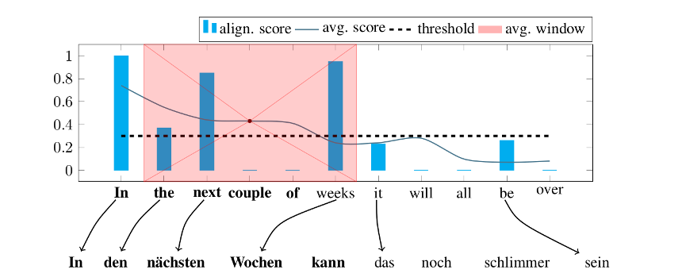

# Unsupervised Parallel Sentence Extraction and Corpus Filtering


<!--  -->

## Dependencies

### Python packages

* python 3.6
* pytorch 1.1.0
* faiss 1.5.3 (GPU version if available)
* numpy 1.16.4
* nltk 3.2.4
* gensim 3.2.0
* python-levenshtein 0.12.0
* tqdm 4.19.5
* langid 1.1.6

Script for installing all dependencies (using conda):
```
./install_requirements.sh
```

### Third-party tools

* Moses
* fastText
* MUSE

Script for install tools:
```
./get_third_party.sh
```

## Examples for running the tools

### Parameters

Parameters can be modified in `environment.sh`
* Executable paths
* Data paths and language pairs
* Experiment parameters

### Data preparation

The project uses monolingual [Newscrawl](http://data.statmt.org/news-crawl/) data from the WMT news translation shared task, gold annotations from the [BUCC](https://comparable.limsi.fr/bucc2017/bucc2017-task.html) 2017 shared task and Paracrawl from [WMT parallel corpus filtering task](http://www.statmt.org/wmt18/parallel-corpus-filtering.html). The required data can be downloaded and preprocessed by running:
```
./get_data.sh
```
Steps:
* Downloading data
* Tokenization
* Training truecase model
* Truecaseing the data
* Output: `./data/`
* The script only prepares En, De, Fr and Ru data. You need to prepare monolingual data and truecase models in case of other languages.

### Generating dictionaries

The approach relies on dictionaries based on bilingual word embeddings and orthography. Embeddings and dictionaries can be generated by running:
```
./generate_dictionaries.sh
```
Steps:
* Running fastText on monolingual data
* Mapping embeddings spaces using MUSE
* Creating embeddings based dictionaries
* Creating orthography based dictionaries
* Output: `./results/dictionaries/`

### Subtasks

#### BUCC2017

The scripts evaluates our method on the BUCC 2017 parallel sentence mining task.

```
./mine_bucc.sh
./print_bucc_results.sh
```
Steps:
* Prefiltering based on document embeddings
* Scoring sentence pair candidates
* Evaluating
* Output: `./results/mining/bucc2017`

#### Extraction from Newscrawl

By default the script extracts sentence pairs from Newscrawl 2011 which have a token length between 21 and 25. For changing default setup see `environment.sh` and `get_data.sh`.

```
./extract_sentences.sh
```
Steps:
* Prefiltering based on document embeddings
* Scoring sentence pair candidates
* Extracting sentences
* Output: `./results/mining/`

#### Filtering WMT18

The scripts filters small portion of noisy parallel corpus released by WMT18 - Parallel corpus filtering task. For changing default setup see `environment.sh`.

```
./corpus_filter.sh
```
Steps:
* Prefiltering based on simple rules
* Scoring pairs
* Extracting pairs with best scores
* Output: `./results/filtering/`


## Cite

Related publications:

[1] V. Hangya and A. Fraser, [Unsupervised Parallel Sentence Extraction with Parallel Segment Detection Helps Machine Translation](https://www.aclweb.org/anthology/P19-1118) in Proceedings of the 57th Annual Meeting of the Association for Computational Linguistics (ACL), 2019.

[2] V. Hangya, F. Braune, Y. Kalasouskaya, and A. Fraser, [Unsupervised Parallel Sentence Extraction from Comparable Corpora.](https://workshop2018.iwslt.org/downloads/Proceedings_IWSLT_2018.pdf#page=22) in Proceedings of the 15th International Workshop on Spoken Language Translation (IWSLT), 2018

[3] V. Hangya and A. Fraser, [An Unsupervised System for Parallel Corpus Filtering.](http://www.aclweb.org/anthology/W18-6477) in Proceedings of the EMNLP 2018 Third Conference on Machine Translation (WMT), 2018

```
@inproceedings{Hangya2019,
author = {Hangya, Viktor and Fraser, Alexander},
title = {{Unsupervised Parallel Sentence Extraction with Parallel Segment Detection Helps Machine Translation}},
booktitle = {Proceedings of the 57th Annual Meeting of the Association for Computational Linguistics},
pages={1224--1234},
year = {2019}
}

@inproceedings{Hangya2018,
author = {Hangya, Viktor and Braune, Fabienne and Kalasouskaya, Yuliya and Fraser, Alexander},
title = {{Unsupervised Parallel Sentence Extraction from Comparable Corpora}},
booktitle = {Proceedings of the 15th International Workshop on Spoken Language Translation (IWSLT)},
pages = {7--13},
year = {2018}
}

@inproceedings{Hangya2018,
author = {Hangya, Viktor and Fraser, Alexander},
title = {{An Unsupervised System for Parallel Corpus Filtering}},
booktitle = {Proceedings of the EMNLP 2018 Third Conference on Machine Translation (WMT)},
pages = {882--887},
year = {2018}
}
```
